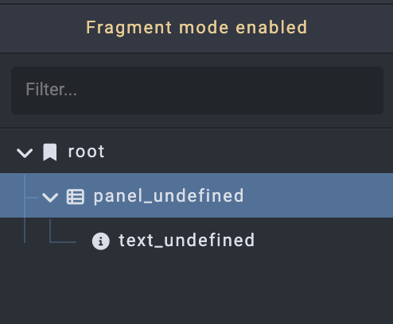
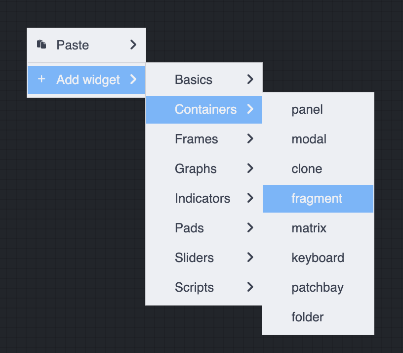
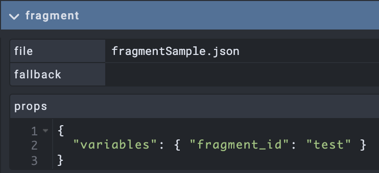

# OPEN STAGE CONTROL HANDBOOK
## https://openstagecontrol.ammd.net

## Using fragments

This guide is a short tutorial showing how to use fragments 
Exemple : you want a custom interface and reuse it in several projects with different parameters

###### create a fragment
This file should contain a single panel with all the sub widgets inside. 
It should be saved with "fragment mode" enabled. 



###### import the fragment  
You can now import that fragment into another project by adding a fragment widget  




Then, you can access it by giving the right filename if they are in the same folder. 
Otherwise you need to give it's full path. 



###### passing variables to a fragment   
Then you can define variables (in props) that will be sent to the fragment. 

You can access that variable in the fragment with the following syntax
`@{parent.variables.fragment_id}`


Or inside a script : 
`getProp("parent", "variables").fragment_id`


###### fragment in matrix
You can also include fragment in matrix widget. 
In that case, the props format should be : 

```
{
  "file": "fragmentSample.json",
  "props": { "variables": {   "fragment_id": "test" } }
}
```

###### SAMPLE 
There is a sample in the codeSamples folder of this repo