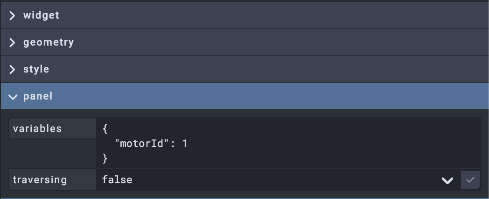

# OPEN STAGE CONTROL HANDBOOK
## https://openstagecontrol.ammd.net


### Scripting :


###### get the current component value : 
`var increment  = get('this');`

###### set a component value : 
`set('face1',face1Val);`


###### update a widget property : 
fill the field with a `VAR{varName}`: 

`setVar("widgetId", "varName", "red")`

###### sending OSC Messages : 
`send( '/any/OSC/Adress', value);`  
`send ('127.0.0.1:1239','/test',val);` (specific target)  
`send ('/test',val,42);` (multiple values)  
`send ('/test',{type: 'i', value: 42});` (integer values)  
`send ('/test',{type: 's', value: 'hello'})` (string values)  


###### seending multiple OSC Messages 
`for( var i = 0 ; i < 5; i ++)`  
`{`  
`   send( '/test/'+i, 1);`  
`}`  

###### get a property : 
`getProp('widgetId','propName')`  
`getProp('salle','address')`(return the adress of the widget named 'salle')  

###### getting objects as JSON
`var range = getProp('salle','range')`  
`console.log('var ' +range.max);`  

###### globals variables : 
`console.log('IP '+globals.ip);`  
`console.log('SCREEN '+globals.screen.width);`  
`console.log('ORIENTATION '+globals.screen.orientation);` 

###### store preset in client (cookies): 
```
storage.setItem('myCat', 'Tom');
const cat = storage.getItem('myCat'); 
console.log('name '+cat)

  
storage.removeItem('myCat'); 
storage.clear();  
``` 

###### template containers 
If you want to create a module to control an index object (eg a motor) and then duplicate it so it controls another one. 

- create a panel  
- create a variable with an id int he panel properties : 

- refer to that ID for every widget id : 

- access the id from scripts `var widgetName = "widget"+getProp("parent", "variables").motorId`
- duplicating the panel and changing the ID will create another instance to control another motor. 


### CUSTOM  MODULES 
#### using external libraries (with npm)
- create a project with npm init 
- install any library 
- create a 'myModule.js" file 
- import the library with "nativeRequire" instead of "require" -> var artnet = `nativeRequire('artnet')`

